# DPDK Generic Receive Offload (GRO)
This document outlines the architecture and operation of the Generic Receive Offload (GRO) library within the Data Plane Development Kit (DPDK).

## Architecture

Generic Receive Offload files are on `<dpdk-folder>/lib/gro/` directory. `rte_gro` is responsible for reading packets in bursts, containing 512 packets of different protocols at most then it will pass the packets with the same type to relative gro_ptype file to be merged. GRO on DPDK supports different packet types: **TCP4**, **TCP6**, **UDP4**, **VXLAN_TCP4**, **VXLAN_UDP4**

### 1. Naming Convention
- each packet is called an item in source code (both merged and unmerged).
- common key of an item is a tuple of (source/destination IP, source/destination port, protocol)
- each flow contains items with the same common key
- two items with same common key with consecutive sequence numbers are called neighbors
- each reassembly table contains flows of the same protocol

### 2. Parameters
GRO has 3 modes based on its [Documentation](https://doc.dpdk.org/dts-20.02/test_plans/dpdk_gro_lib_test_plan.html#test-case1-dpdk-gro-lightmode-test-with-tcp-ipv4-traffic). Different modes can be set via flush parameter in testpmd interactive mode. `rte_gro_timeout_flush` sends the packet to upper layer when timeout occurs after flush parameter value of receive burst calls. it will also update the header if the packet is merged. If any merged packet reaches maximum size of its type (like 64KB for TCP4) then it is sent to upper layer

### 3. Data Structures
General reassembly table of `rte_gro` passes different packet types to protocol-specific reassembly tables like TCP where merging is handled. Each reassembly table is a hash table, where its key is its protocol common key and its value contains a pointer to the head mbuf of the reassembled packet and other state information (e.g., the TCP sequence number it's waiting for next). The main responsibilites of reassembly tables' associated functions are:
- **Check TCP sequence numbers** to ensure packets are contiguous.
- **Compare the TCP 5-tuple** (source/destination IP, source/destination port, protocol) for flow matching.
- **Handle TCP flags** like FIN and PUSH correctly, which often signal the end of a merge opportunity.

# Instrumentation
Trace points can be put inside function bodies of both header and C files that their name start with `rte_`.These trace points may emit the input parameters of functions or extra arguments in `gro_trace.h` and each of their names should be regestered in `gro_trace_points.c`, determining dumped trace point name. As `rte_gro.h` functions do not contain bodies, we shall use normal instrumentation instead of fast path. It is neccessary to add file names to `meson.build` located in `lib/gro/`. Changed and new files are accessible via gro folder of this repo.

# Setup

We use dpdk-testpmd to forward packets between two virtual ethernet (veth) ports and experiment with various offloading options of dpdk including gro.

Two namespaces and two veth interfaces are created, with one end of each veth interface in each of the namespaces and the other end in the host side. The host end of veth interfaces is connected to dpdk-testpmd and traffic is sent from one namespace to the other using iperf3.

**Create Two veth Interfaces**
```shell
sudo ip netns del ns1
sudo ip link add veth-ns1 type veth peer name veth-host1
sudo ip addr add 10.1.1.2/24 dev veth-host1 
sudo ip link set veth-host1 up

sudo ip netns del ns2
sudo ip link add veth-ns2 type veth peer name veth-host2
sudo ip addr add 10.1.1.4/24 dev veth-host2 
sudo ip link set veth-host2 up
```

**Create and Configure Namespace ns1**
```shell
sudo ip netns add ns1
sudo ip link set veth-ns1 netns ns1
sudo ip netns exec ns1 ip link set veth-ns1 up
sudo ip netns exec ns1 ifconfig veth-ns1 10.1.1.1/24 up
```

**Create and Configure Namespace ns2**
```shell
sudo ip netns add ns2
sudo ip link set veth-ns2 netns ns2
sudo ip netns exec ns2 ip link set veth-ns2 up
sudo ip netns exec ns2 ifconfig veth-ns2 10.1.1.3/24 up
```

**Turn off tx/rx offloads on the kernel driver:**
Some offload features on the kernel side mess up testpmd when forwarding tcp traffic. Turn them off:

```shell
sudo ip netns exec ns1 ethtool -K veth-ns1 tso on
sudo ethtool -K veth-host2 gro off
sudo ethtool -K veth-host1 tx off rx off
sudo ethtool -K veth-host2 tx off rx off
sudo ip netns exec ns1 ethtool -K veth-ns1 tx off rx off
sudo ip netns exec ns2 ethtool -K veth-ns2 tx off rx off
```

**Meson Configuration of Build Environment**
```shell
meson setup build \
-Dexamples=all \
-Dlibdir=lib \
-Denable_trace_fp=true \
-Dc_args="-finstrument-functions"
```

**Ninja for Build and Install**
```shell
cd build
ninja
sudo meson install
sudo ldconfig
```

**Hugepages Configuration**
```shell
sudo sysctl -w vm.nr_hugepages=1024
mount -t hugetlbfs none /dev/hugepages
```


**Run dpdk-testpmd**
```shell
sudo dpdk-testpmd -l 0-3 -n4 --vdev 'eth_af_packet0,iface=veth-host1' --vdev 'eth_af_packet1,iface=veth-host2' --trace=lib.gro.* --trace-mode=overwrite --trace-bufsz=20M -- -i --forward-mode=io
```

**Interactive configure dpdk-testpmd**
```shell
set fwd csum
csum mac-swap off 0
csum mac-swap off 1
stop
port stop 0
port stop 1
set port 0 gro on
set port 1 gro on
set gro flush 1
port start 0
port start 1
start
```

**Generate Traffic**

On namespace ns2 run the server side
```shell
sudo ip netns exec ns2 iperf3 -s -B 10.1.1.3
```

On namespace ns1 run the client side
```shell
sudo ip netns exec ns1 iperf3 -c 10.1.1.3 -t 0
```

# Performance Tuning

In this section, we summarize the evaluation of the **Generic Receive Offload (GRO)** feature in the **Data Plane Development Kit (DPDK)**. The focus was to analyze the impact of GRO on packet reception and transmission, particularly how different **flush values** affect network performance.

### Goal

The tests aim to measure:

* **Throughput**: How fast data is transmitted over the network.
* **Packet Processing**: The number of packets received and transmitted.

We tested flush values of 1, 2, and 4 to explore the trade-offs between packet aggregation and throughput.

---

## Flush 1

**Command**: `set gro flush 1`

### Test Results

#### Throughput (iperf3)

* **Average Throughput**: 2.71 Gbps
* **Observation**: Throughput was stable with minor fluctuations.

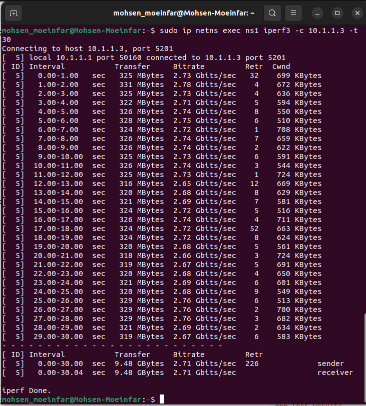

#### Packet Statistics (dpdk-testpmd)

* **RX Packets**: \~7.03M, with no errors or drops
* **TX Packets**: \~3.29M, roughly half of the received packets
* **RX/TX Ratio**: \~2.14, indicating effective packet merging

**Observation**: GRO successfully reduced the packet rate while maintaining the same data volume.

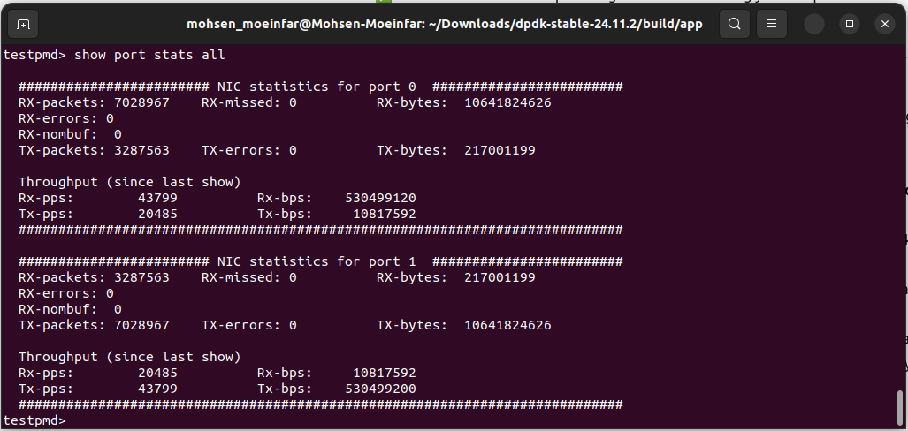

---

## Flush 2

**Command**: `set gro flush 2`

### Test Results

#### Throughput (iperf3)

* **Average Throughput**: 2.65 Gbps
* **Observation**: Slightly lower than Flush 1 due to added buffering, causing minor latency and occasional TCP retransmissions.

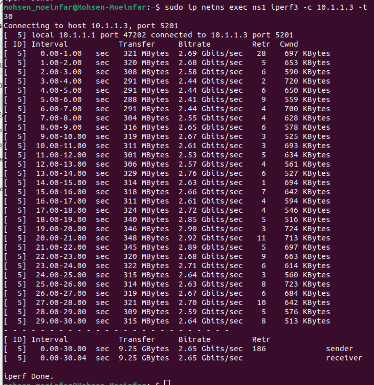

#### Packet Statistics (dpdk-testpmd)

* **RX Packets**: \~6.76M
* **TX Packets**: \~3.15M
* **RX/TX Ratio**: \~2.15, showing slightly improved packet merging

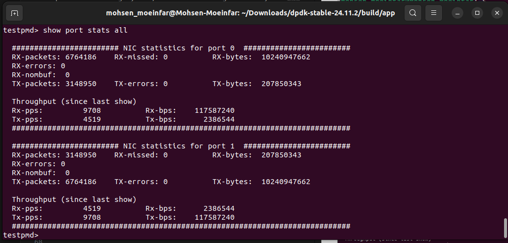

---

## Flush 4

**Command**: `set gro flush 4`

### Test Results

#### Throughput (iperf3)

* **Average Throughput**: 2.64 Gbps

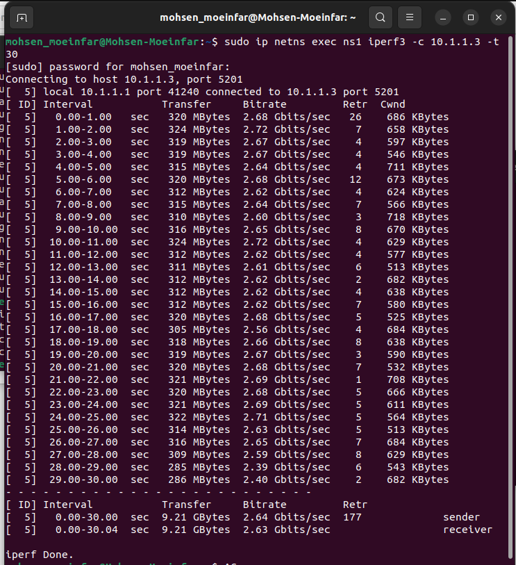

#### Packet Statistics (dpdk-testpmd)

* **RX Packets**: \~6.83M
* **TX Packets**: \~3.18M
* **RX/TX Ratio**: \~2.15, confirming effective packet aggregation

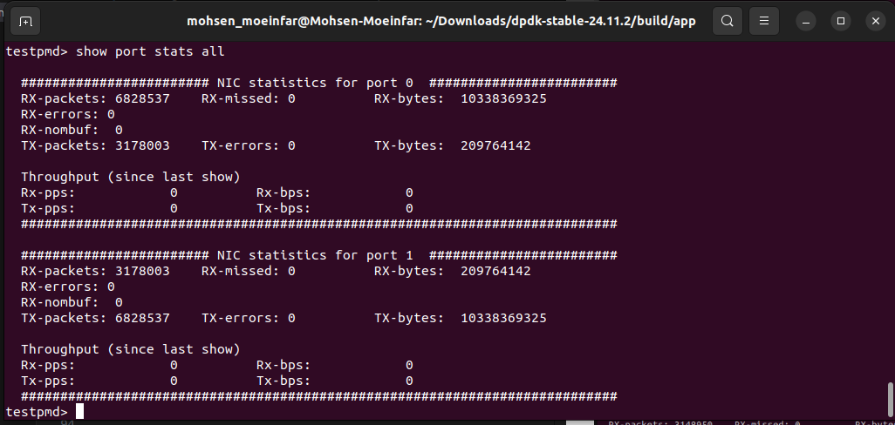

---

## Conclusion


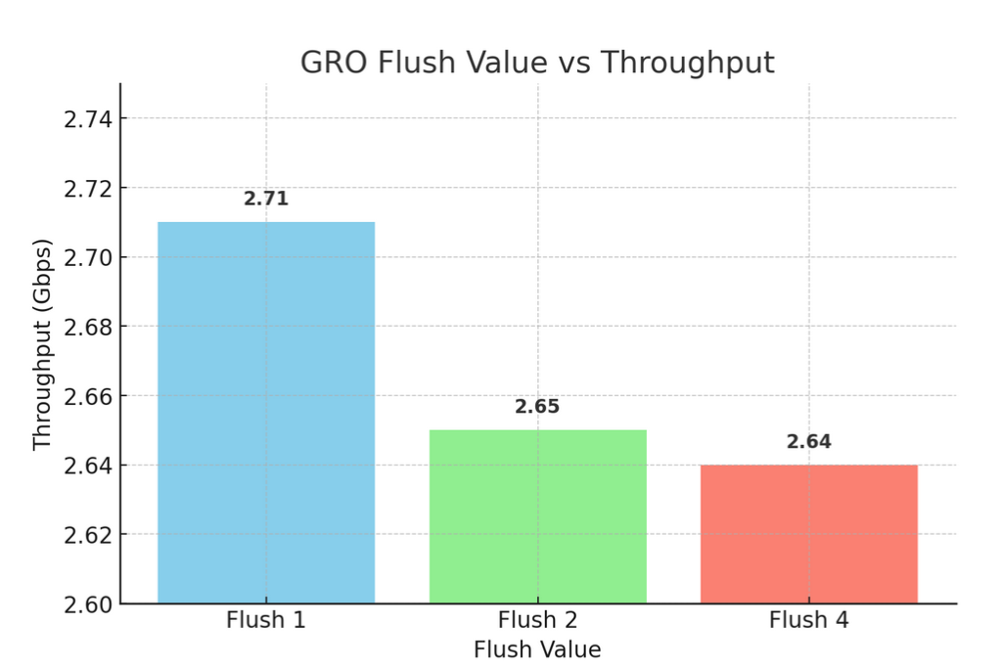

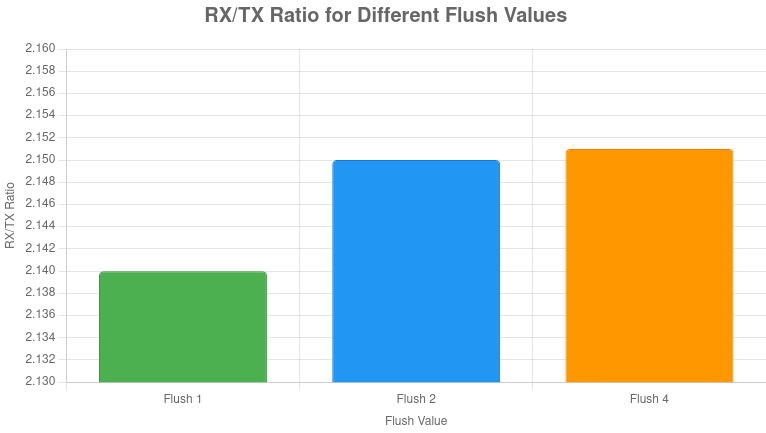


* **Flush 1** gives the highest throughput (2.71 Gbps) but generates more packets to process.
* **Flush 2** slightly reduces throughput (\~2.65 Gbps) but improves packet aggregation efficiency.
* **Flush 4** achieves the best balance between throughput and packet merging, reducing CPU load without sacrificing much speed.


# Analysis
## 1. Light mode
`rte_gro_reassemble_burst` can handle at most 32 packets in each call and merge them as most as possible. There is no timeout set for the packets since they will be flushed as soon as they get merged.

---
> ▸ _`pkts` is a pointer to mbuf linked list. `nb_pkts` is the number of packets that are supposed to be processed on that specific burst call, varying from 1 to 32. `param_max_flow_types` is the maximum number of flows inwhich reassembly table will store till sending them to application layer which is set to 4._

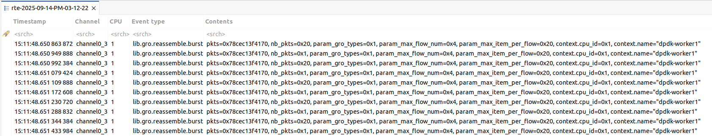

## 2. Heavy mode
with flush parameter set to 2 and above heavy mode is activated, making gro library to process packets by including timeout parameter.

---
> ▸ _`rte_gro_ctx_create` is called 3 times in each run in first place. At first glance it may seem contradictory where `param_max_item_per_flow` is set to 512, but this context is general and responsible for all protocols but will send 32 packets to specific protocol to be merged._

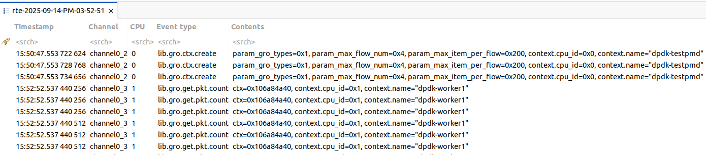


# GRO Behavior for Out-of-Order Packets

## Introduction

In this report, we explore the behavior of **Generic Receive Offload (GRO)** when handling **out-of-order (OOO)** TCP packets. We will detail the sequence of events when GRO encounters packets that do not arrive in the expected order, how these packets are processed, and how they are eventually merged or stored.

## Flow Overview

GRO is responsible for efficiently combining multiple incoming TCP packets into larger segments before they are passed to the application. When packets arrive out of order, GRO uses various mechanisms to ensure data integrity and efficient processing.

## Behavior of GRO for Out-of-Order Packets

### 1. Initial Packet Processing

* **Validation of TCP Header**: GRO first checks if the incoming packet's TCP flags (e.g., ACK, PSH, FIN) are valid. Packets with invalid flags (e.g., SYN, RST) are rejected.
* **Payload Size**: The payload length is checked to ensure it is greater than zero. If not, the packet is discarded.
* **Flow Lookup**: GRO attempts to find an existing flow for the incoming packet. If no flow is found, a new flow is created (typically for pure ACK packets).

```c
if (unlikely(INVALID_TCP_HDRLEN(pkt->l4_len))) return -1;
if (tcp_hdr->tcp_flags & ~VALID_GRO_TCP_FLAGS) return -1;
tcp_dl = pkt->pkt_len - hdr_len;
if (tcp_dl <= 0) return -1;
```

### 2. Neighbor Search and Sequence Check

* If a matching flow is found, GRO checks whether the incoming packet can be merged with existing packets in that flow. This is done by comparing the sequence number and IP ID.
* **Sequence Check**: The sequence number (`sent_seq`) and IP ID of the incoming packet are compared with the existing packets. If they match, the packets are merged.

```c
cmp = check_seq_option(&items[cur_idx], tcp_hdr,
        sent_seq, ip_id, pkt->l4_len, tcp_dl, 0, is_atomic);
if (cmp) {
    if (merge_two_tcp_packets(&items[cur_idx], pkt, cmp, sent_seq,
                              tcp_hdr->tcp_flags, ip_id, 0))
        return 1; 
}
```

### 3. Packet Merging

* **Appending or Prepending**: If the incoming packet is part of an existing flow, it is either appended or prepended to the existing packets based on the sequence number comparison.
* **Limits on Merging**: There are certain constraints on how much data can be merged, such as the total IP packet size and the number of segments.

```c
if (pkt_head->pkt_len - l2_len + pkt_tail->pkt_len - hdr_len > MAX_IP_PKT_LENGTH) return 0;
if (unlikely(pkt_head->nb_segs >= 20)) return 0;
```

* If the merge is successful, the merged packet is updated and the flow is updated accordingly.

### 4. Out-of-Order Packet Storage

* If the incoming packet cannot be merged with existing packets, it is stored as a **separate island** in the flow’s list. It is added at the end of the linked list of packets, waiting for the missing segments to arrive.


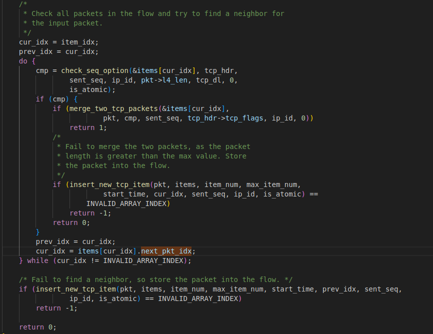

### 5. Immediate Flush for PSH/FIN Packets

* If the packet contains the **PSH** or **FIN** flag, even if it is out of order, it is processed and flushed immediately. This ensures that the TCP flow can complete promptly, even when there are gaps in the sequence of received packets.

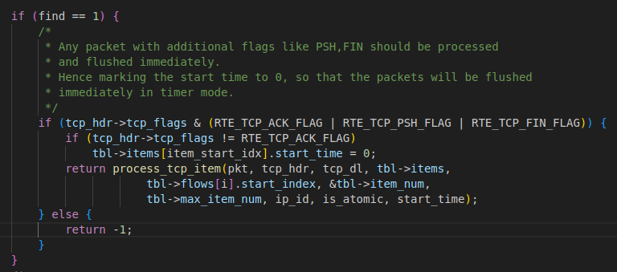


### 6. Timeout Flush

* GRO periodically checks if any packets in the flow have timed out and are ready to be processed. Packets with a `start_time` earlier than the current timestamp are flushed to the application, and the flow is updated.
* **Flow Processing**: If multiple segments have been merged, the total IPv4 length is updated.

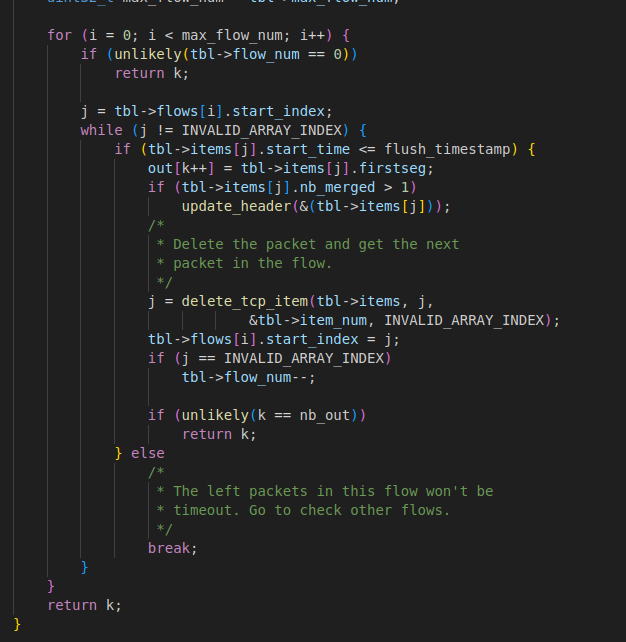


## Summary

* **Out-of-order packets** are handled by **searching for a matching flow**, **checking if they can be merged** with existing packets based on sequence number and IP ID, and either merging them or storing them as separate "islands" for future merging.
* **PSH/FIN packets** are **immediately flushed** to ensure timely processing, even if they arrive out of order.
* **Timeouts** trigger the flushing of merged packets that have been held for too long.


---

# GRO Behavior for Fragmented Packets (TCP vs UDP)

## TCP/IPv4 (fragmentation)

* **Scope:** TCP-GRO is **not** an IP reassembly path; it only merges **complete** TCP/IPv4 packets (full L4 header + payload > 0).
  [For more details, refer to the official DPDK documentation.](https://doc.dpdk.org/guides-18.05/prog_guide/generic_receive_offload_lib.html)

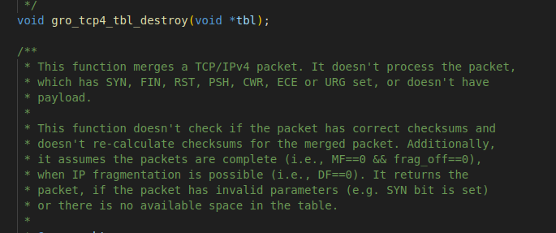


* **Fragmented input:** If a packet is IPv4-fragmented (MF=1 or `frag_offset>0`), it is **not reassembled** by TCP-GRO and is **skipped** by the library .
* **DF/ID rule for complete packets:**

  * **DF=1 (atomic):** ignore IPv4 ID.
  * **DF=0:** require IPv4 ID continuity **only** to validate merging of complete packets (still not IP reassembly).

## UDP/IPv4 (fragmentation)

* **Scope:** GRO-UDP targets **IPv4 fragments**. Non-fragmented UDP packets are **skipped** (no merge).
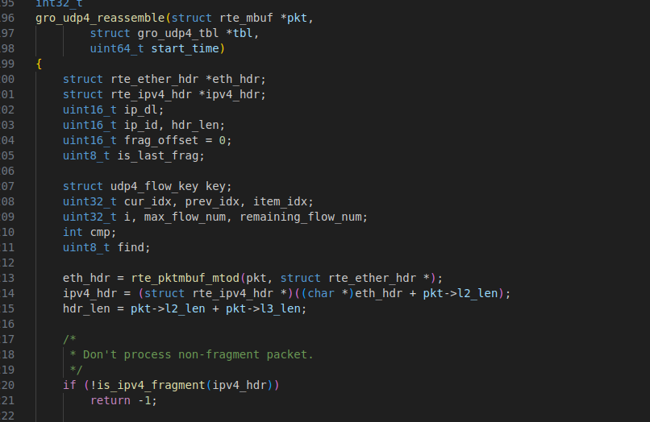

* **Fragment handling:** Fragments of the same datagram are grouped by **IP-ID**; adjacency is determined by **fragment offset + length**.
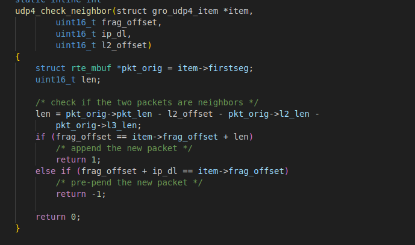


* **Finalization:** If a fragment can’t merge immediately, it’s kept for that datagram; on timeout/flush, contiguous fragments are merged and the IPv4 header is updated (total length set, **MF** cleared when the last fragment is present).
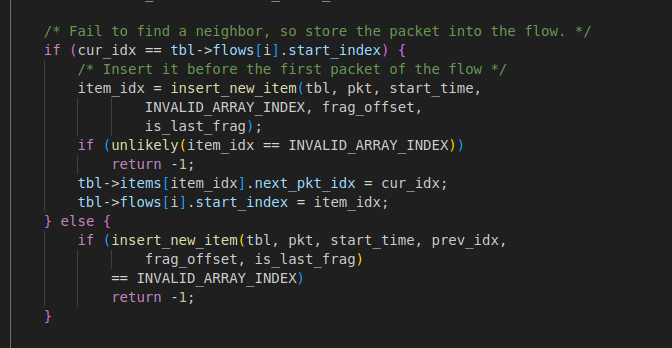


